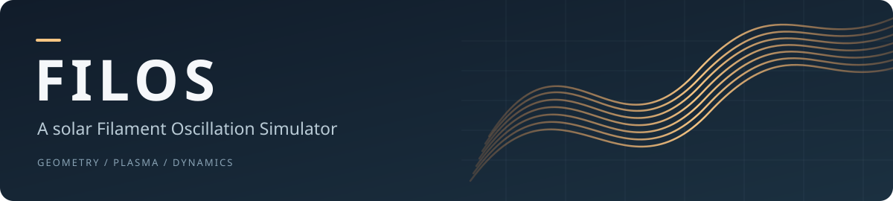
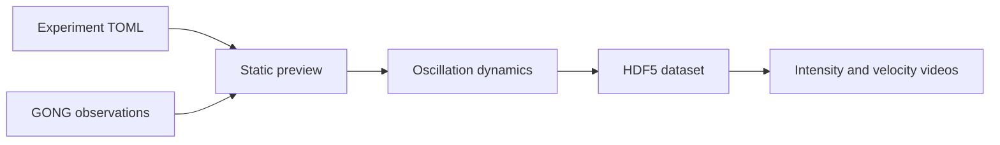

<p align="center">
  
</p>

<p align="center">
  <a href="#quick-start">Quick start</a> ·
  <a href="#workflow">Workflow</a> ·
  <a href="#repository-map">Repository map</a> ·
  <a href="docs/README.md">Documentation</a> ·
  <a href="LICENSE">MIT license</a>
</p>

FILOS generates synthetic solar filaments in Hα against observed GONG backgrounds.
It combines thread geometry, plasma and opacity calculations, oscillation dynamics,
and instrument degradation in a Python model with a local Streamlit interface.

| Build | Explore | Export |
| :--- | :--- | :--- |
| Seeded filament geometry and plasma profiles | Static previews and configurable oscillations | HDF5 simulation datasets |
| Observation crops with optional filament detection | Shared-period or curvature-based Luna dynamics | GONG intensity and velocity MP4s |

## Quick start

Run commands from the repository root. Use **Python 3.12 or 3.13**; 3.12 is recommended.

### With uv

```bash
uv run --extra gui --extra detector streamlit run scripts/experiment_gui.py
```

Open **http://localhost:8501**. Stop the server with **Ctrl+C**.
The command installs the core package and the GUI and detector extras as needed.

### With pip

```bash
python3.12 -m venv .venv
source .venv/bin/activate
python -m pip install -e '.[gui,detector]'
python -m streamlit run scripts/experiment_gui.py
```

For the pinned direct dependencies, including notebook tools, use
`python -m pip install -r requirements.txt` instead of the editable-install command.

### Local inputs

The default experiment uses these separately supplied assets:

| Requirement | Location / setup |
| :--- | :--- |
| GONG background sequence | `FITS_files/20140101.h5`, containing a `time_series` dataset |
| Local detector model | `FilamentSegmentator/models/detector_v1/`, containing `config.json` and `model.safetensors` |
| Video encoder | FFmpeg on `PATH`, with `libx264` support; FFprobe is also needed for the GUI regression script |

These large inputs are local and excluded from Git. The GUI can open before they
are supplied; generating a preview requires a valid background. The default
profile enables the detector. To work without it, disable **Use detector** in the
GUI (or set `dynamic_background.use_detector = false` in your experiment) and
install only the `gui` extra. See [data and outputs](docs/DATA.md).

The launcher defaults to GPU index `1` when `CUDA_VISIBLE_DEVICES` is unset.
Select your device explicitly if needed:

```bash
CUDA_VISIBLE_DEVICES=0 uv run --extra gui --extra detector streamlit run scripts/experiment_gui.py
```

Set `CUDA_VISIBLE_DEVICES=""` to use the detector on CPU.

## Workflow



1. **Create or load an experiment** in the Streamlit sidebar.
2. **Adjust the configuration**: background, morphology, plasma, dynamics, and export settings.
3. **Generate a preview** to inspect the realized filament and diagnostics.
4. **Generate the simulation** from the current preview, then inspect completed runs and videos.

New experiments start from [configs/default_experiment.toml](configs/default_experiment.toml).
The GUI saves experiment configurations, job records, and versioned runs under
`simulations/experiments/`. Production runs use a detached worker and a saved
configuration snapshot.

## Repository map

```text
FILOS/
├── synthetic_filaments/       Python model and experiment orchestration
│   └── data/                  Packaged opacity table and spine library
├── scripts/                   GUI, workers, regression checks, and benchmarks
├── configs/                   Shared experiment defaults
├── docs/                      Setup details, architecture, and performance
├── notebooks/                 Reference-notebook instructions
│   └── local/                 Personal exploration; ignored by Git
├── processed/                 Calibration provenance and reference products
├── FITS_files/                Local observation data
├── FilamentSegmentator/       Local detector assets
├── simulations/               Generated experiments and runs; ignored by Git
├── pyproject.toml             Package metadata and optional dependencies
└── requirements.txt           Pinned direct dependencies for pip
```

The existing package, script, and input paths are retained because the runtime
resolves assets relative to them. See the [codebase guide](docs/STRUCTURE.md) for
module responsibilities and file-placement conventions.

## Working with the model

| Task | Guide |
| :--- | :--- |
| Run checks, benchmarks, or diagnostics | [Script reference](scripts/README.md) |
| Generate the reference notebook | [Notebook workflow](notebooks/README.md) |
| Supply observations and inspect saved runs | [Data and outputs](docs/DATA.md) |
| Tune workers, caching, and export compression | [Performance controls](docs/PERFORMANCE.md) |
| Trace the calibrated opacity table | [Calibration provenance](processed/README.md) |

The scientific regression uses the reference observations and detector assets:

```bash
uv run --extra detector python scripts/run_scientific_regression.py --include-dynamics
```

The opacity model includes a calibrated **1–100 Mm** extension of the Heinzel
Table 1 data. Its provenance, published-anchor checks, and limitations are
documented in the [calibration archive](processed/heinzel_table1_extension_final/README.md).

## License

[MIT](LICENSE) · Copyright © 2026 Guillem Castelló i Barceló.
