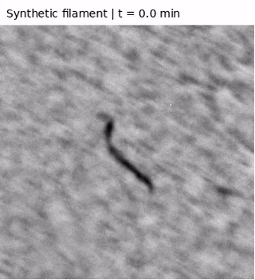
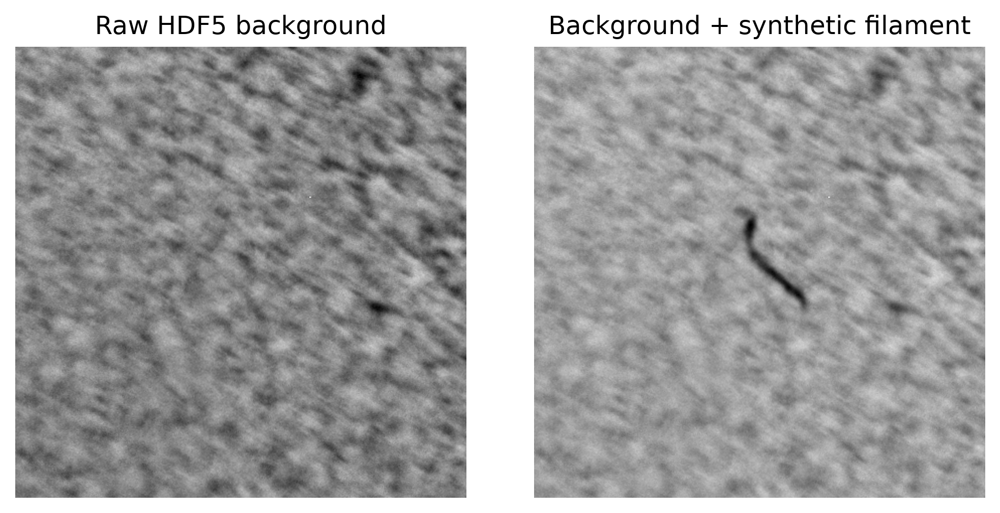
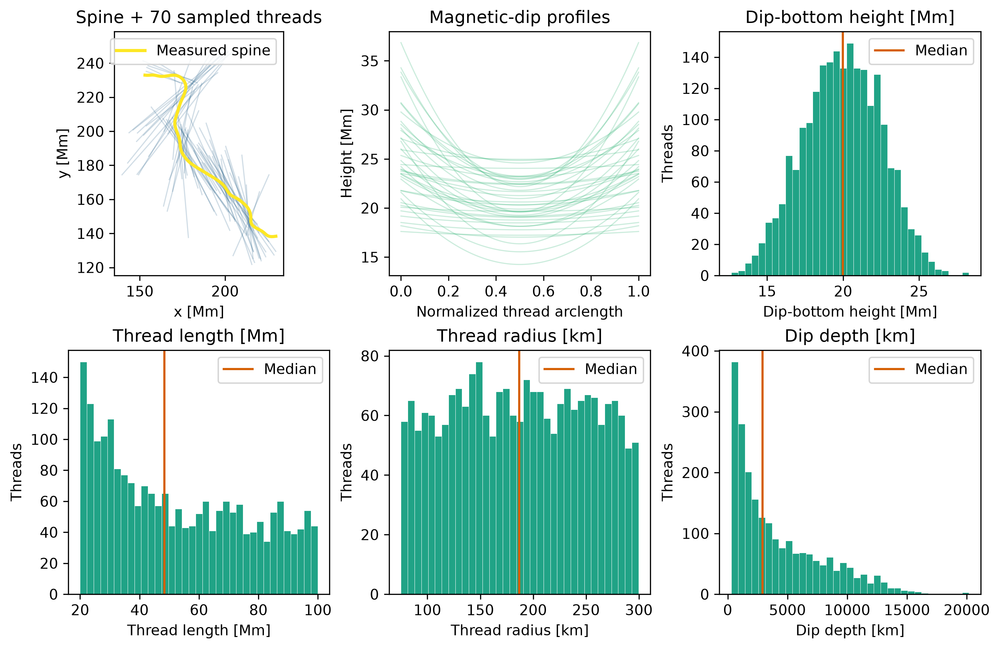
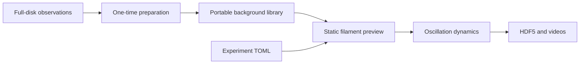

<p align="center">
  
</p>

<p align="center">
  <a href="#quick-start">Quick start</a> ·
  <a href="#example">Example</a> ·
  <a href="#prepare-your-own-backgrounds">Prepare backgrounds</a> ·
  <a href="docs/README.md">Documentation</a> ·
  <a href="LICENSE">MIT license</a>
</p>

FILOS generates synthetic solar filaments in Hα against observed GONG backgrounds.
It combines thread geometry, plasma and opacity calculations, oscillation dynamics,
and instrument degradation in a Python model with a local Streamlit interface.

| Build | Explore | Export |
| :--- | :--- | :--- |
| Seeded filament geometry and plasma profiles | Static previews and configurable oscillations | HDF5 simulation datasets |
| Prepared quiet-Sun observation sequences | Shared-period or curvature-based Luna dynamics | Intensity and velocity videos |

## Quick start

You need **Python 3.12 or 3.13**, **FFmpeg**, and at least one prepared background
sequence. The normal workflow needs no detector model, PyTorch, or GPU.

From the downloaded repository, create and activate a virtual environment:

```bash
python3.12 -m venv .venv
source .venv/bin/activate
python -m pip install -r requirements.txt
```

For video export, install FFmpeg through your system package manager. On
Ubuntu/Debian: `sudo apt install ffmpeg`. On macOS with Homebrew: `brew install ffmpeg`.
The encoder must include `libx264`; these packages also supply FFprobe for checks.
The detached-worker workflow currently targets Linux/macOS.

Put the prepared `.h5` background files supplied by the project maintainers in
`backgrounds/`, then launch:

```bash
python -m streamlit run scripts/experiment_gui.py
```

Open **http://localhost:8501**. Create an experiment, generate a preview, and select
**Generate video**. Stop the server with **Ctrl+C**.

On subsequent visits, activate `.venv` and run the launch command again.

### Choose a background

In **Background sequence**, select a file or leave **Library (choose by background
seed)** selected. You can also enter a custom file or library-directory path.
Changing the background seed selects reproducibly from the available library.

Each file contains the actual observation pixels and its observing geometry.
Dimensions and cadence are read automatically. The default simulation uses
**120 frames**; choose a suitable frame count, starting index, and frame step for
other sequences. Original full-disk observations are only needed during preparation.

## Example

A simulation using a prepared GONG background and the curvature-based Luna
oscillation model. Click the preview to open the intensity video.

[](docs/assets/example/gong.mp4)

[Intensity video](docs/assets/example/gong.mp4) ·
[Velocity video](docs/assets/example/velocity.mp4) ·
[Run configuration](configs/readme_example.toml)



<details>
<summary>Thread geometry diagnostics</summary>



</details>

The comparison shows the observed background and the synthesized frame zero.
The animation shows simulated motion against the evolving, unchanged observation
sequence. Run details and background provenance are recorded in the
[example notes](docs/assets/example/README.md).

To reproduce it after obtaining the named background file:

```bash
python scripts/run_experiment.py --config configs/readme_example.toml
```

## Prepare your own backgrounds

Place aligned full-disk observations in `FITS_files/`, then run:

```bash
python scripts/prepare_backgrounds.py
```

This scans all source `.h5` files and saves up to two **448 × 448**, **120-frame**
sequences per source into `backgrounds/`. It uses the source timestamps to find
uninterrupted 60-second intervals and screens **every frame** for invalid pixels
and large dark/bright structures. It preserves the selected pixels without
interpolation or normalization. Some sources or intervals may yield no acceptable crops.

You can also prepare a particular file:

```bash
python scripts/prepare_backgrounds.py FITS_files/20141018.h5 --frames 120 --count 2
```

Optional detector screening is available for library preparation:

```bash
python -m pip install -e '.[prepare]'
python scripts/prepare_backgrounds.py --use-detector
```

That option requires the separately supplied local detector weights and screens
sampled frames in addition to the all-frame structural checks. Detector loading
errors stop preparation; they do not silently downgrade the screening.
Review prepared sequences before sharing them. See the
[background format and preparation guide](docs/BACKGROUNDS.md), including how to
package your own already-cropped observations.

## Workflow



Experiments and versioned runs are saved under `simulations/experiments/`.
Each production job records its configuration and the specific background file
selected from the library.

## Repository map

```text
FILOS/
├── synthetic_filaments/       Model, background loading, and experiment workflow
│   └── data/                  Packaged opacity table and spine library
├── scripts/                   GUI, preparation, command-line runs, and checks
├── configs/                   Default and example experiment settings
├── backgrounds/               Prepared sequences; HDF5 files stay local
├── FITS_files/                Full-disk source observations; stay local
├── docs/                      Guides and example media
├── tests/                     Background tests and historical reference fixture
├── notebooks/                 Reference-notebook workflow and local exploration
├── processed/                 Calibration provenance and reference products
├── simulations/               Generated runs; stay local
├── pyproject.toml             Python package metadata
└── requirements.txt           Standard pip installation
```

| Task | Guide |
| :--- | :--- |
| Supply or prepare portable backgrounds | [Background guide](docs/BACKGROUNDS.md) |
| Inspect configuration and saved runs | [Data and outputs](docs/DATA.md) |
| Run checks, benchmarks, or diagnostics | [Script reference](scripts/README.md) |
| Use the reference notebook | [Notebook workflow](notebooks/README.md) |
| Understand the modules | [Codebase guide](docs/STRUCTURE.md) |
| Tune workers and memory | [Performance controls](docs/PERFORMANCE.md) |

The opacity model includes a calibrated **1–100 Mm** extension of the Heinzel
Table 1 data. See the [calibration archive](processed/heinzel_table1_extension_final/README.md)
for its provenance, published-anchor checks, and limitations.

## License

[MIT](LICENSE) · Copyright © 2026 Guillem Castelló i Barceló.
